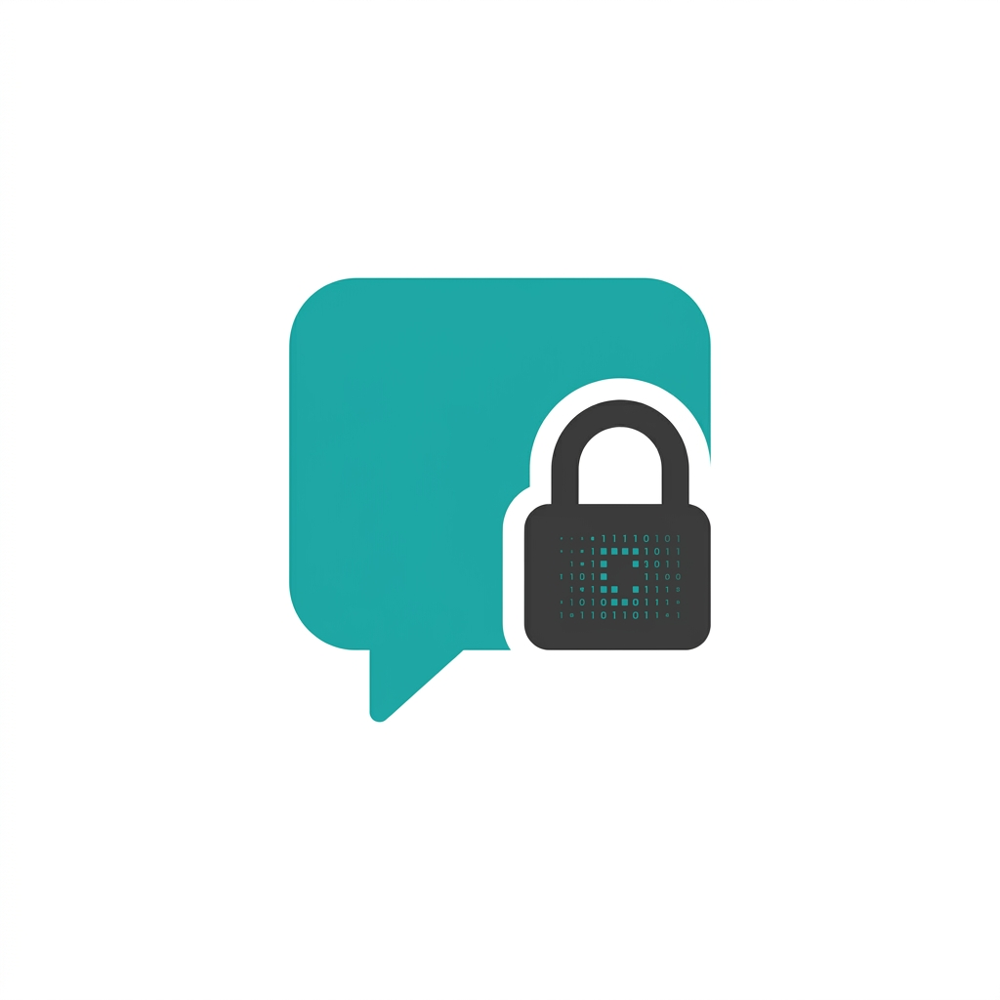

<div align="center">
  
  <h1>CryptoChat</h1>
  <p>A secure, serverless cross-platform encrypted chat application with a unique scramble-to-unscramble viewing experience.</p>
</div>

---

## 🔒 Features

- **X-Ray Lens Encryption:** Messages appear as scrambled gibberish by default. Hold <kbd>SHIFT</kbd> on Desktop or **Long Press** on Mobile to decode and read the messages.
- **View Once Photos:** Send self-destructing photos. Once the recipient uses the X-Ray lens to view the photo, it is permanently deleted from the server and the chat history.
- **Smart Chat Organization:** Chats are neatly organized into swappable tabs: *Primary*, *General*, *Requests*, and *Archived*.
- **Background Notifications:** True background operation on Android. Receive instant local notifications for new messages even when the app is minimized, powered by foreground services and WakeLocks.
- **Social Authentication:** Seamlessly log in using Google or GitHub accounts via Firebase Auth.
- **Monetization with Privileges:** Integrated AdMob (App Open and Bottom Banners) with conditional rendering. Trusted users (marked via Firestore) enjoy a 100% ad-free experience natively.
- **Cross-Platform Support:** 
  - 🌐 **Web:** Built with React and Vite.
  - 📱 **Mobile:** Native Android app powered by Capacitor.
- **Real-Time Sync & Serverless Architecture:** Lightning-fast messaging powered entirely by Firebase Firestore.

## 🛠️ Tech Stack

- **Frontend:** React, Vite, Vanilla CSS
- **Backend & Database:** Firebase (Authentication, Firestore, Storage)
- **Mobile Wrapper:** Ionic Capacitor
- **Capacitor Plugins:** `@capacitor-community/admob`, `@anuradev/capacitor-background-mode`, `@capacitor/local-notifications`, `@capacitor-firebase/authentication`, `@capacitor/status-bar`

## 🚀 Getting Started

### Prerequisites

- Node.js (v18+)
- Firebase Project (with Firestore, Storage, and Auth enabled)
- Java SDK & Android Studio (for Android builds)

### 1. Web Setup

Clone the repository and set up the web project:

```bash
cd frontend
npm install
```

Create a `.env` file in the `frontend` directory with your Firebase configuration:
```env
VITE_FIREBASE_API_KEY=your_api_key
VITE_FIREBASE_AUTH_DOMAIN=your_auth_domain
VITE_FIREBASE_PROJECT_ID=your_project_id
VITE_FIREBASE_STORAGE_BUCKET=your_storage_bucket
VITE_FIREBASE_MESSAGING_SENDER_ID=your_messaging_sender_id
VITE_FIREBASE_APP_ID=your_app_id
```

Start the development server:
```bash
npm run dev
```

The web app will be available at `http://localhost:5173`. 

### 2. Build for Mobile (Android .apk)

Ensure you have your AdMob App ID configured in `frontend/capacitor.config.json` and `frontend/android/app/src/main/AndroidManifest.xml`.

Build the web assets and sync with Capacitor:
```bash
cd frontend
npm run build
npx cap sync android
```

Compile the release APK:
```bash
cd android
./gradlew assembleRelease
```
The generated APK will be located in `frontend/android/app/build/outputs/apk/release/app-release.apk`.

## 🎨 Design Philosophy

CryptoChat prioritizes a seamless, fluid user experience with micro-animations and a sleek visual language. The X-Ray lens adds an interactive element of physical security to messaging—ensuring shoulder-surfers see nothing but scrambled noise, while you safely read your messages on demand.

## 📄 License

This project is open-source and available under the MIT License.
